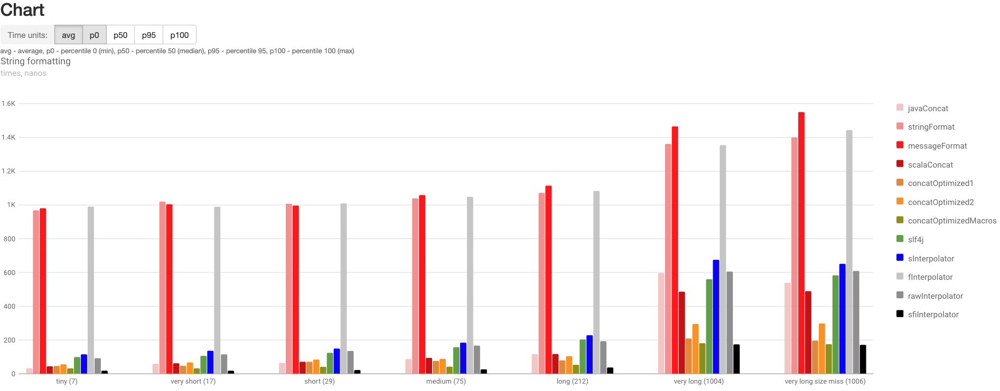
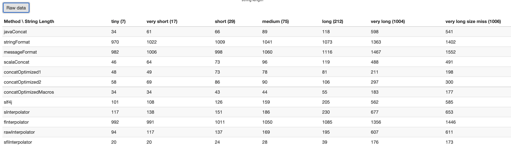

### Scala String Interpolation Performance [](https://travis-ci.org/dkomanov/scala-string-format)

A source code for the article "Scala: String Interpolation Performance" at [medium](https://medium.com/@dkomanov/scala-string-interpolation-performance-21dc85e83afd).

Recent charts for the article is at https://dkomanov.github.io/scala-string-format/.

# Spec
- scala 2.13
- java 11

# Run 
```aidl
./jmh-run.sh
```

# Result
- result can be found in /docs/jmh-result.json
- viewer is located /docs/index.html that parses the data and display it on a chart
#### Chart


#### Raw Data



